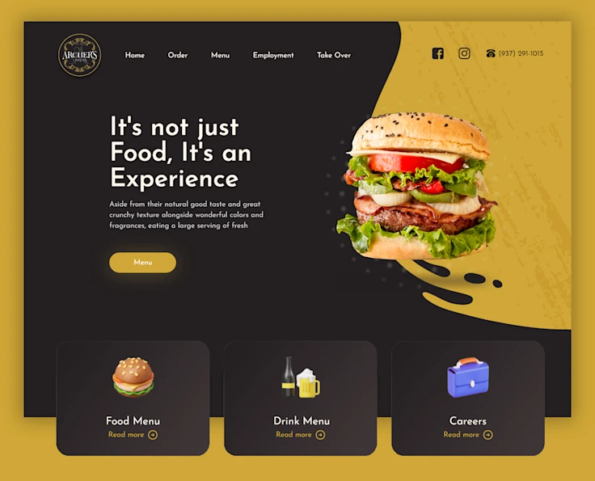
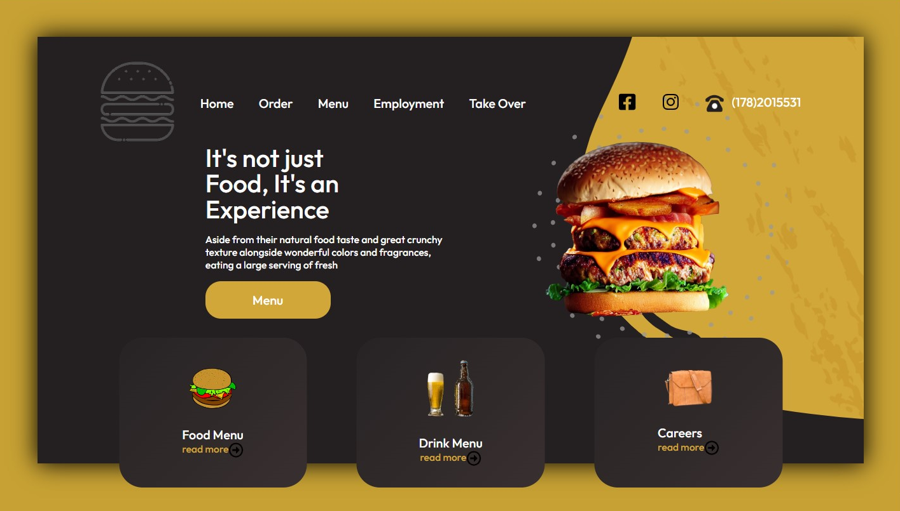
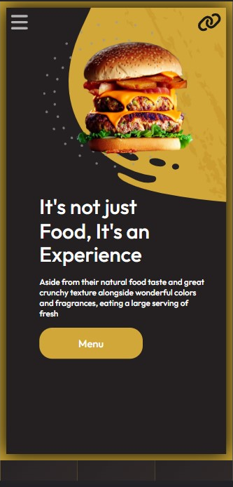
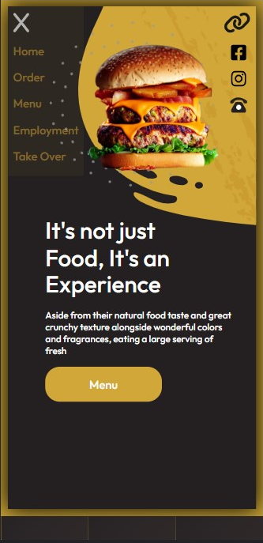

## Burger Project

A replication of a static web page and conversion to a responsive design.

## Table of contents

- [Overview](#overview)
  - [Screenshot](#screenshot)
  - [Links](#links)
- [My process](#my-process)
  - [Built with](#built-with)
- [Author](#author)

## Overview

### Screenshot

This is the desktop view as designed 

This is the desktop view as recreated on the using HTML, css

Subsequent mobile view alongside the javascript enabled navigation bar

<!--  -->

### Links

- Solution URL: [Link to my solution git repo](https://github.com/breeMudi/burger)
- Live Site URL: [Link to project view on git-hub live server](https://breemudi.github.io/burger/)

## My process

This project was developed considering chrome browsers.

The various steps in this project include:

1. define the components of the page
2. source for icon images on fontawesome
3. create icons that are pro version
4. create yellow background drop
5. insert images and texts into html
6. design with css
7. create relevant buttons and assign duties with javascript
8. Most Important! consider responsive design

### Built with

- Semantic HTML5 markup
- CSS custom properties
- Flexbox
- Mobile-first workflow
- [Styled Components](https://styled-components.com/) - For styles

## Author

- Twitter - [@Bridgetmudiaga](https://www.twitter.com/Bridgetmudiaga)

  
